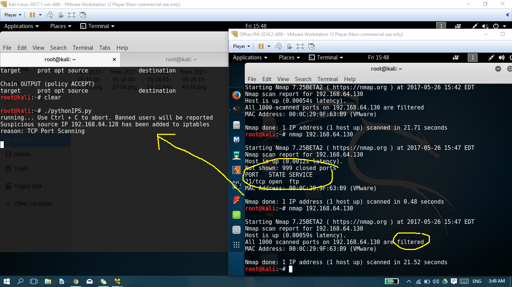

# Easy Intrusion Prevention System 
1. Install snort 
    For debian linux:
    ```sh
    apt-get update && apt-get install snort
    ```
    For redhats: Try replace `apt-get` with `yum`
2. Snort configuration file
    ```nano /etc/snort/snort.conf```
    > Ctrl + W : ipvar HOME_NET
    change the HOME_NET value from `any` to your `ip address`
    
    Eg. `ipvar HOME_NET 192.168.1.2`
    
    Lets say you are hosting a web server at port 80 and ftp at 21.
    You will want other ports to be considered as unwanted ports.
    > Ctrl + w : portvar
    add a line `UNWANTED_PORT [!80, !21]`

    We will be using these variables in our rule writing.
    
3. Snort rule (custom.rules)
    > alert tcp any any -> $HOME_NET $UNWANTED_PORT (msg: "Bad Traffic Unwanted port"; sid:1000007; rev:1;)
    
    > alert tcp any any -> $HOME_NET any (msg:”Possible Port Scan”; detection_filter:track by_src, count 50, seconds 60; sid:1000005; rev:1;)

    Copy and paste these rules into `/etc/snort/rules/local.rules`
    
4. Run Snort
    ```
    snort -A FAST -c /etc/snort/snort.conf -i eth0 -p -l ~/snortlog
    ```
    I assume that the traffic you want to tap is on interface `eth0`.
    I set the non-promiscuous mode using `-p` so that only traffic that are meant for you will be viewed. (read more on promiscuous)
    The alerts will be sent to `~/snortlog/alert` in ascii form.

5. Run IPS python script
    `./pythonIPS.py 192.168.1.2 2 ~/snortlog/alert`
    > arg1: own ip
    
    > arg2: interval in seconds
    
    > arg3: location of the alert file

    This script will try to match the alert with TAGS specified. When matched, it will ban the ip address by adding the IP address into the iptables INPUT chain.

    ##### Improvement:
     The script will read through the alert file every n seconds instead of reading infinitely in a while loop. It will continue reading where it left off previous unless the script was killed abruptly such as using the linux `kill <pid>` command.
    
    Aborting using Ctrl + C will flush the current `alert` to `alert.bak`
    so that when restarting the script, this script will read in fresh alerts instead of old snort alerts.
    
    Using `tag.upper() in line.upper()` allow case insensitivity of tags.
    
    
    
---
An earlier strategy that I had was to set up various fake services. 
These fake services will be labeled as open by nmap, tricking a curious hacker to visit them. Note: When crafting a good nmap command, the hacker may be able to bypass our "Possible Port Scan" rule.

When connected, it will reply connection refuse with secret white spaces behind.
These secret white spaces `"\x08\x08\x09"` will trigger my following snort rule.
> alert tcp $HOME_NET any -> any any (msg:"Trap services triggered"; content:"|07 08 09|";rawbytes; sid:1000003; rev:1;)

My python script sees this alert and ban their ip address.

simply run:
`nc -nvlp 22 -c "./trig.py 192.168.1.2 22 ssh"`

What you should see:
```
root@kali: ~ # nc 192.168.1.2 22
(UNKNOWN) [192.168.1.2] 22 (ssh) : Connection refuse
```
This looks like a normal response when connected to a closed port.
Yet, this trap service will activate our IPS to ban them! Sounds interesting? 
My further research brought to me the `UNWANTED_PORT` idea that works even better than the "Trap services triggered" rule.
